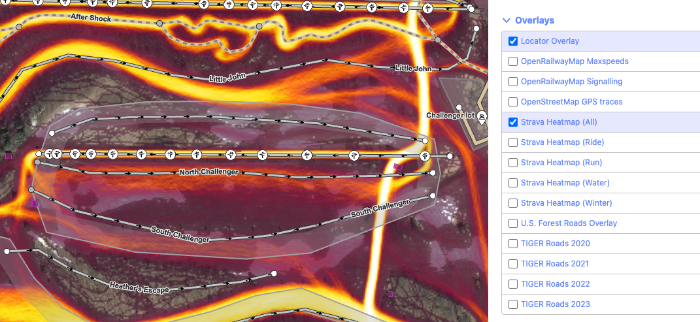
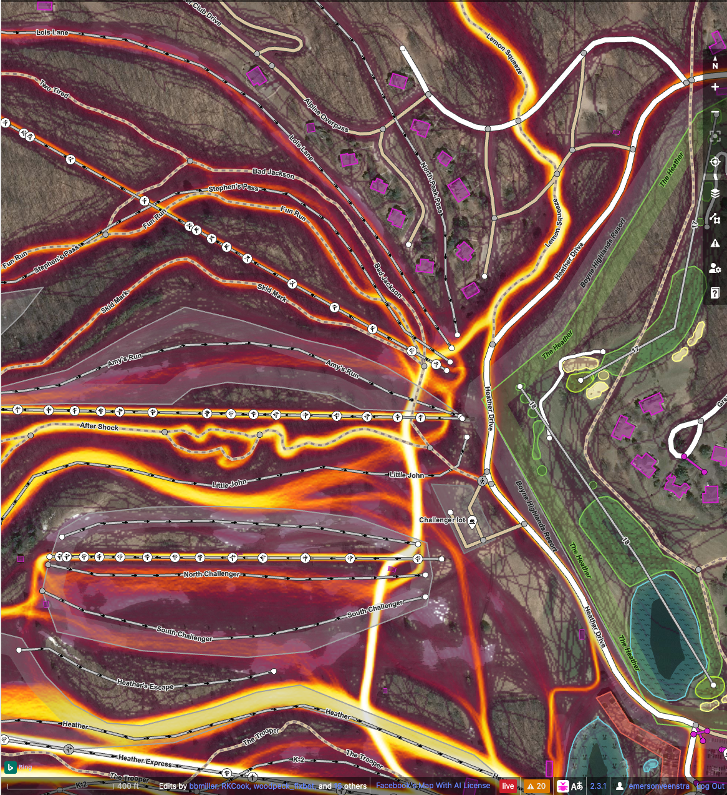

# Rapid Power User Extension

A Chrome and Firefox extension to seamlessly integrate Rapid as your primary OSM web editor. Currently does two things:

1. Redirects the OSM.org Edit button to open in Rapid
2. Integrates Strava Heatmap overlays into Rapid (credit to the original [id-strava-heatmap extension](https://github.com/cmoffroad/id-strava-heatmap-extension) for some of the code)

## How to use
Download for Chrome or Firefox (soon!), or clone this repository, copy either `manifest-chrome.json` or `manifest-firefox.json` to `manifest.json` and load it directly from the folder. When installed, the plugin will show up in your toolbar somewhere. If the plugin icon is orange, then you need to log into Strava by clicking the plugin icon. Once you're logged in to Strava, the icon will turn pink and Strava support is enabled.

If you don't want to use Strava you can just hide the plugin icon, it will still redirect everything from iD to Rapid without being logged into Strava.

## Known bugs
- Sometimes you need to refresh the page after logging in to Strava for the plugin to recognize the cookies
- Strava disappears beyond zoom level 20 on Rapid (this is a Rapid issue, not an extension issue)

## Screenshots

