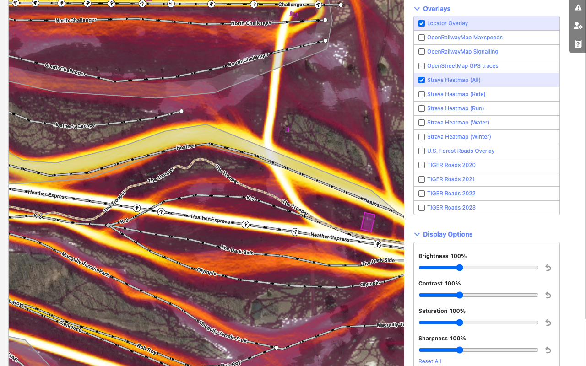

# Rapid Power User Extension

A Chrome and Firefox extension to seamlessly integrate Rapid as your primary OSM web editor. Currently does two things:

1. Redirects the OSM.org Edit button to open in Rapid
2. Integrates Strava Heatmap overlays into Rapid (credit to the original [id-strava-heatmap extension](https://github.com/cmoffroad/id-strava-heatmap-extension) for some of the code)

Should work on all Chromium-based and Gecko-based browsers that support Manifest V3 extensions, I test it on Firefox, Brave, Vivaldi, and Chrome. 

## Install 

### From Chrome or Firefox store
Download for [Firefox](https://addons.mozilla.org/addon/rapid-power-user-extension/) or Chrome (waiting for review!)

### From git
Clone this repository, run `./sync-shared.sh`. Load the extension from the `chrome/` ([See Instructions](https://developer.chrome.com/docs/extensions/get-started/tutorial/hello-world#load-unpacked), this is also for Chromium/Vivaldi/Brave/etc.) or `firefox/` folder ([See instructions](https://developer.mozilla.org/en-US/docs/Mozilla/Add-ons/WebExtensions/Your_first_WebExtension#installing))

There is also a `local/` directory for loading into Chromium-based browsers that allows the extension to work on `http://127.0.0.1:8080` for local Rapid development.

## Using

When installed, the plugin will show up in your toolbar somewhere (it may be hidden behind an overflow icon at first). If the plugin icon is orange, then you need to log into Strava by clicking the plugin icon. Once you're logged in to Strava, load [the heatmap](https://www.strava.com/maps/global-heatmap), the icon will turn pink (may need to refresh the page one time) and Strava support is enabled.

If you don't want to use Strava you can just hide the plugin icon, it will still redirect everything from iD to Rapid without being logged into Strava.

## Known bugs
- Sometimes you need to refresh the page after logging in to Strava for the plugin to recognize the cookies
- Strava disappears beyond zoom level 20 on Rapid (this is a Rapid issue, not an extension issue)

## Screenshots

https://github.com/emersonveenstra/rapid-power-user-extension/assets/5402360/b69b59d7-76ab-4d7c-8927-ee180d612b6c

